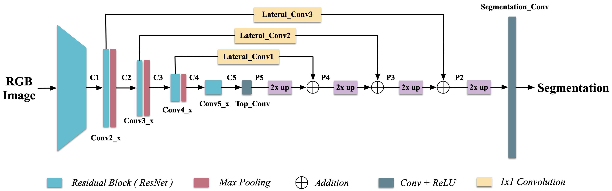

# RVSS 2021 Workshop
The repository contrains the CNN modeule for the fruit detection task.
This is a light-weight fully convolutional network that infers at approximatly 3 fps on a CPU. 

Current input resolution is set to 256x192, the segmentation mask is a quater of the input, i.e. 128x96
## Before you start
Dependencies
- pytorch 1.6 +
- tqdm

[TODO: create a new env and test what dependencies are required]

## Test the network
1. [Download the network pre-trained weights here](https://anu365-my.sharepoint.com/:u:/g/personal/u5240496_anu_edu_au/ESmsPOMqqf5NqThB_uC4qeUBWLu8O35pg9zTWvuIV_tQig?e=BSjwQL). Extract the 'weights' folder and put it under ~/scripts forder.

2. change directory to 'scripts', open and run detector_test.ipynb

## Train the network
1. [Download the sample dataset here](https://anu365-my.sharepoint.com/:u:/g/personal/u5240496_anu_edu_au/Ec3PqU60nk5Amcfznr25XpMBthefcgvu6cqG340p8cDYFQ?e=HKRQ53). Extract the file.

2. Run:
    ```
    $ cd <path_to_folder>/scripts
    $ python python main.py --dataset_dir <full_path_to_dataset> --output_folder <folder to save the weights>
    ```
3. Run `python main.py -h` to get a list of configuratble parameters, including network hyper-parameters

## Training Data 
[TODO:] add instructions of running the dataset generator 


## Network Architecture:

*Illustration of the network architecture*

The network has a auto-encoder, decoder structure.
ResNet18 with pre-trained weights is used as the auto-encoder. 
The decoder is inspired by the "lateral connection" proposed by Lin et al. in _Feature Pyramid Network for Object Detection, 2016_. 

 

ResNet Architecture             |  Lateral Connection
:-------------------------:|:-------------------------:
  |  

